# Cloud Media Storage - Frontend

Cloud Media Storage is a web-based cloud file management application that allows users to securely upload, organize, manage, preview, share, and access their files.

## Features

- User Sign Up
- User Sign In
- Google OAuth Authentication
- Current User Authentication
- Logout
- File Upload
- Drag and Drop File Upload
- File Preview
- File Download
- File Share
- File Rename
- File Move
- File Delete
- File Restore
- Star File
- Unstar File
- File Search
- Search Pagination
- Recent Files
- Shared Files
- Starred Files
- Trash
- List View
- Grid View

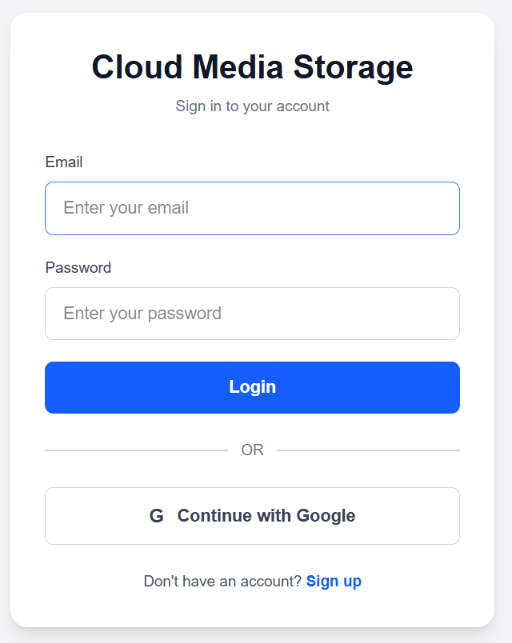
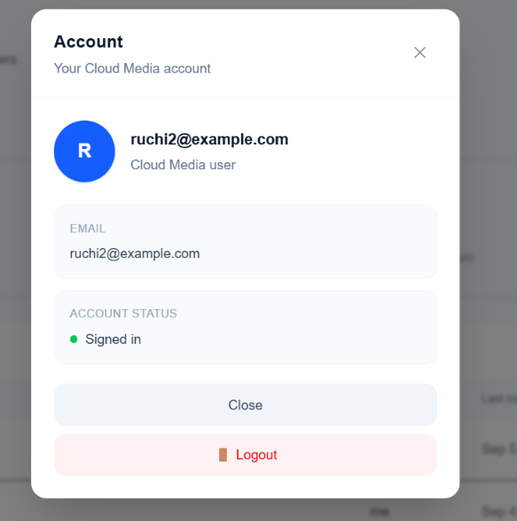
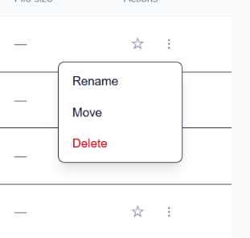
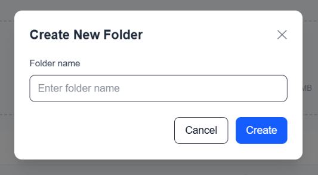
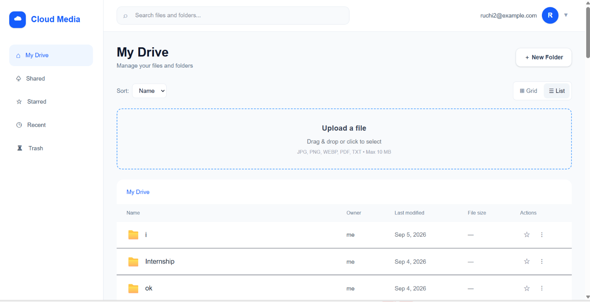
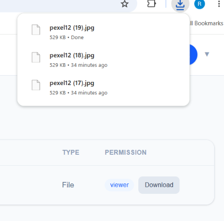
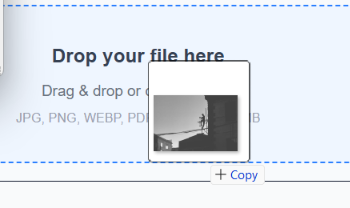
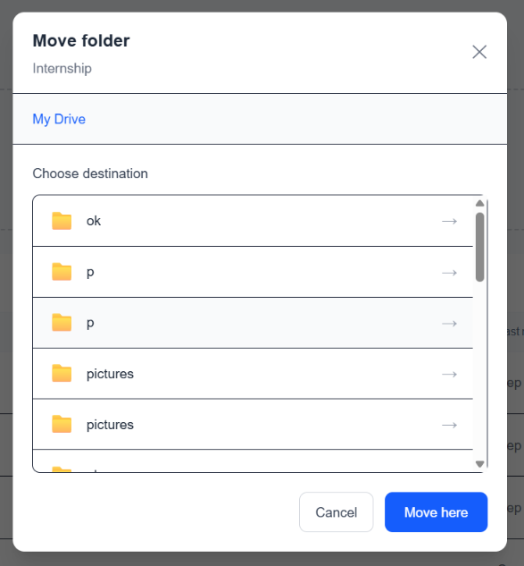
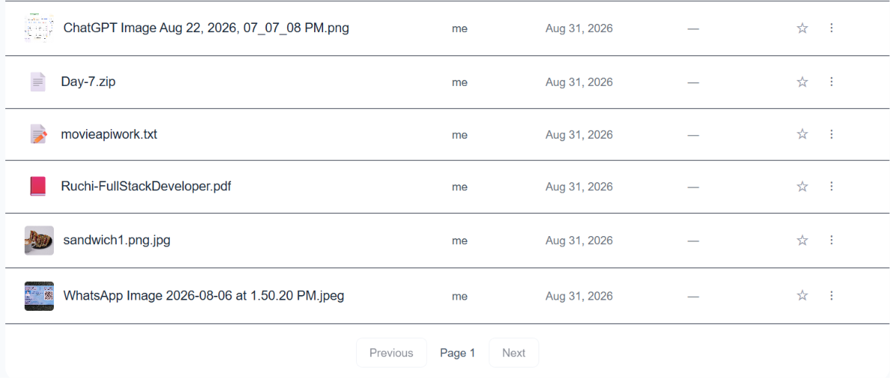
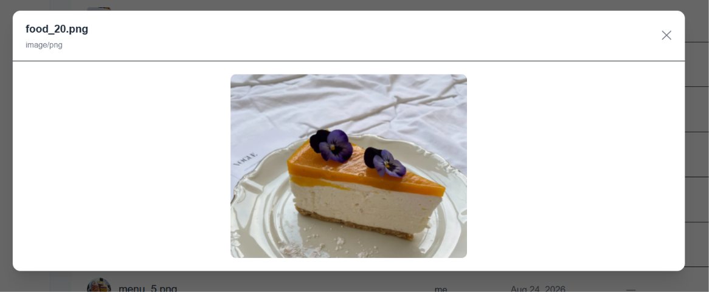
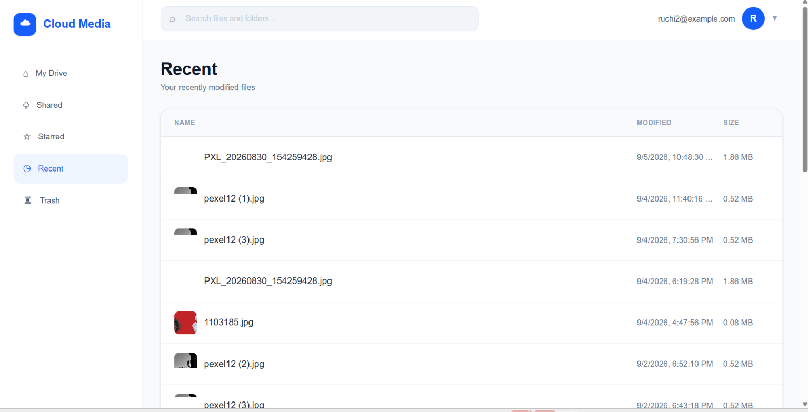
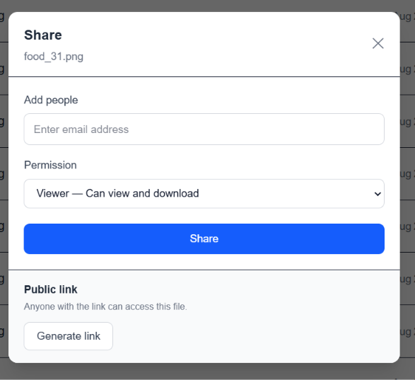
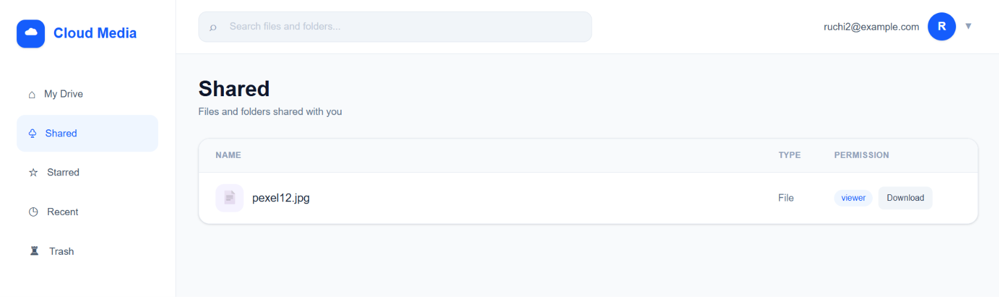
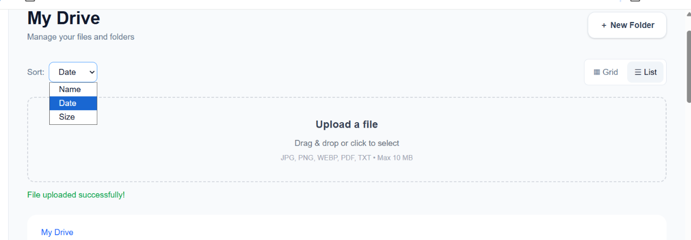
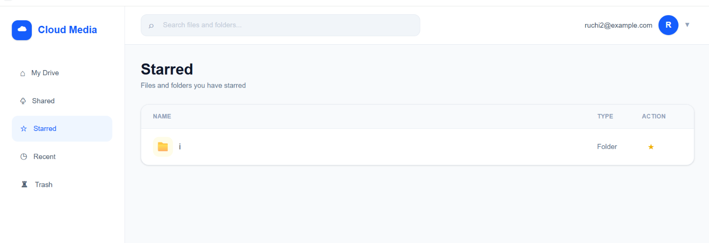
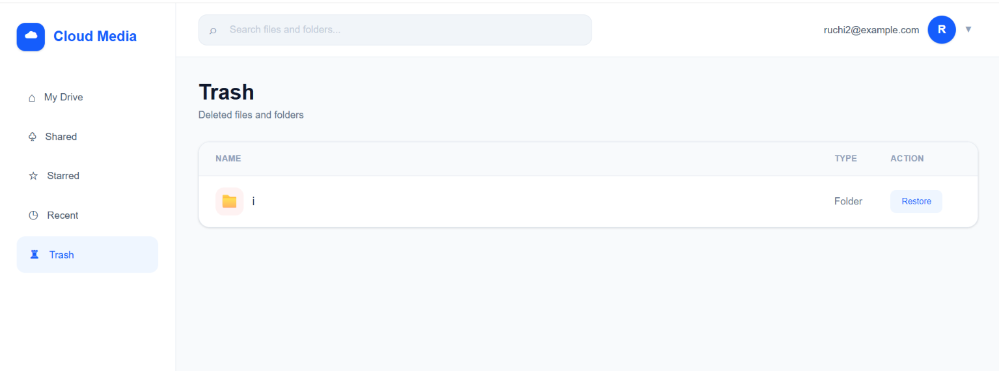


## Authentication

The application supports authentication using email and password as well as Google OAuth.

### Sign Up

New users can create an account using their name, email, and password.

### Sign In

Existing users can sign in using their email and password.

### Google OAuth

Users can also sign in using their Google account through Google OAuth authentication.

After successful authentication, users are redirected to the dashboard.

### Logout

Users can securely log out from their account using the logout option.

## File Management

Users can manage their files directly from the dashboard.

### Upload

Files can be uploaded using:

- File selection
- Drag and drop

### File Actions

Users can perform the following actions on files:

- Preview
- Download
- Share
- Rename
- Move
- Delete
- Restore
- Star
- Unstar

## File Preview

Users can preview supported files directly from the application without downloading them first.

## File Sharing

Users can share files with other users through the file sharing functionality.

## Trash

Deleted files are moved to the Trash section.

Users can restore files from Trash when needed.

## Starred Files

Users can star important files for quick access.

Starred files can be viewed from the Starred section.

## Recent Files

The Recent section provides quick access to recently accessed or modified files.

## Search

Users can search for files using the search functionality.

Search results support pagination for navigating through multiple pages of files.

## View Modes

The application provides two file viewing modes.

### List View

Files are displayed in a detailed list format.

### Grid View

Files are displayed in a grid layout for easier visual browsing.

## Tech Stack

- Next.js
- React
- JavaScript
- Tailwind CSS
- React Hot Toast

## Environment Variables

Create a `.env.local` file in the frontend root directory.

```env
NEXT_PUBLIC_API_URL=your_backend_api_url
```

For local development:

```env
NEXT_PUBLIC_API_URL=http://localhost:8080
```

For production, use the deployed backend API URL.

## Installation

Navigate to the frontend directory:

```bash
cd frontend
```

Install the project dependencies:

```bash
npm install
```

Create a `.env.local` file and configure the required environment variable.

## Running the Application

Start the development server:

```bash
npm run dev
```

The application will run on:

```text
http://localhost:3000
```

## Google OAuth Flow

```text
Login Page
    ↓
Continue with Google
    ↓
Backend Authentication
    ↓
Google OAuth
    ↓
Authentication Callback
    ↓
Access Token
    ↓
Dashboard
```

## File Management Flow

```text
Dashboard
    ↓
Upload / Drag and Drop
    ↓
Files
    ↓
Preview / Download / Share
    ↓
Rename / Move / Star
    ↓
Delete
    ↓
Trash
    ↓
Restore
```

## API Connection

The frontend communicates with the backend through the following environment variable:

```env
NEXT_PUBLIC_API_URL
```

The backend handles authentication, file management, sharing, and other server-side operations.

## Deployment

The frontend is deployed using Vercel.

For production deployment:

1. Add `NEXT_PUBLIC_API_URL` to the Vercel environment variables.
2. Set it to the production backend API URL.
3. Deploy the application.
4. Test authentication and file management functionality.

## Production

Frontend:

```text
https://cloud-media-storage-frontend.vercel.app
```

Backend:

```text
https://cloud-media-storage-backend.onrender.com
```

## Author

Cloud Media Storage